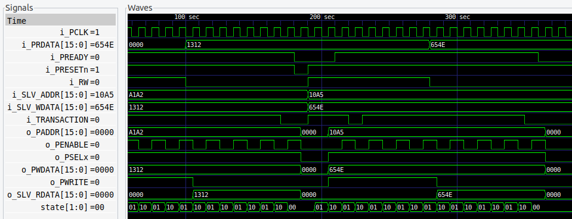
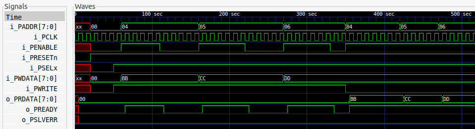
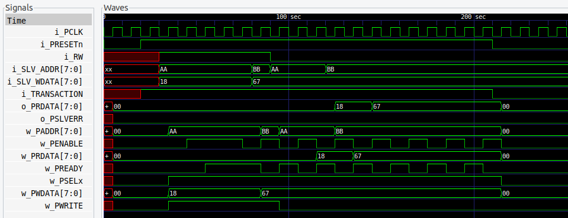

# Overview

The **APB bus** is part of the AMBA protocol family, used for connecting low-bandwidth peripherals.  
This project demonstrates:
- An **APB Master** capable of generating APB transactions.  
- An **APB Slave** that responds to Master transactions.  
- A **Top module** integrating one Master and one Slave.  

This design can be used as a **reference** for learning APB protocol or as a **base project** for building SoC subsystems.


## Features
- Verilog-based RTL implementation.  
- Follows **AMBA APB protocol** specifications.  
- Supports **read and write** transactions.  
- Includes **testbenches** for verification.  


## Repository Structure
├── src/  
│ ├── apb_master.v  
│ ├── apb_slave.v  
│ └── apb_top.v  
│  
├── tb/  
│ ├── tb_apb_master.v  
│ ├── tb_apb_slave.v  
│ └── tb_apb_top.v  
│  
└── README.md  


## Simulation Waveforms

### 1. APB Master
  
*The APB Master generates control, address, and data signals to initiate read/write transactions.*

### 2. APB Slave
  
*The APB Slave decodes the address, processes read/write requests, and provides response signals.*

### 3. APB Top Integration
  
*The Top module connects one APB Master with one APB Slave using standard APB interface signals.*


## Simulation
To run simulation, use any Verilog simulator (e.g., **Icarus Verilog**, **ModelSim**, **Xcelium**).  

Example with Icarus Verilog:
```sh
# Compile
iverilog -o apb_top.out src/apb_master.v src/apb_slave.v src/apb_top.v tb/tb_apb_top.v

# Run
vvp apb_top.out

# Waveform can be viewed with GTKWave
gtkwave dump.vcd
```

## Future Scope
  - Extend Master to handle multiple Slaves.
  - Parameterize address and data widths.
  - Add APB bridge support for AHB/AXI.


## References

- [ARM AMBA 3 APB Protocol Specification (official PDF)](https://developer.arm.com/documentation/ihi0024/latest)  
- [ARM AMBA 4 APB Protocol Specification (official PDF)](https://developer.arm.com/documentation/ihi0024/b)  
- [AMBA APB Overview – ARM Community](https://community.arm.com/amba/)  
- [ASIC-World APB Bus Tutorial](https://www.asic-world.com/systemverilog/apb_buses.html)  
- [AMBA APB Bus Protocol Explained (VLSI Verify)](https://vlsiverify.com/amba-apb-bus-protocol/)  
- [ChipVerify – APB Protocol Basics](https://www.chipverify.com/asic/apb-bus)  

